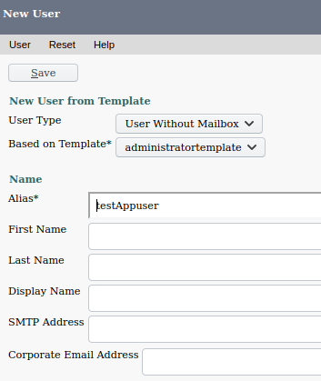

# unity-connection-apis-python-samples

## Overview

Sample scripts demonstrating usage of Cisco Unity Connection APIs with Python

https://developer.cisco.com/site/unity-connection/overview/

## Tested environments

- Ubuntu 19.10
- Python 3.7.5
- Unity Connection 11.5 / 12.5

This project was developed/tested using [Visual Studio Code](https://code.visualstudio.com/)

## Available samples

* `cuni_notification_logger.py` - Demonstrates creating a subscription for mailbox event updates using the CUNI SOAP notification service

* `cupi_add_user.py` - Creates / deletes a test user

* `cumi_send_message.py` -  Executes the following sequence:

    * Creates a test user
    * Sets the user's password
    * Performs a user address lookup
    * Sends a message with audio file attachment
    * Deletes all messages in the user's inbox
    * Deletes the user

* `cupi_add_update_user_notificationdevice.py` - Creates a test user then updates details for the user's default SMTP notification device.

## Getting started

* Install Python 3

  (On Windows, choose the option to add to PATH environment variable)

* Clone this repository:

    ```bash
    git clone https://www.github.com/CiscoDevNet/unity-connection-apis-python-samples
    ```

* Create a Python virtual environment:

    ```bash
    python3 -m venv venv
    source venv/bin/activate
    ```
* Dependency Installation:

    ```bash
    pip install -r requirements.txt
    ```
  
* Rename the file `.env.example` to `.env` and edit to specify your CUC address/credentials - the user must be an administrator:

    

    >Note: see individual sample header comments for additional configs as needed

* If using VS Code, simply open the **Run** tab, select the desired sample and click the green 'run' arrow.

    Otherwise, from the terminal you can launch Flask-based apps this way:

    ```bash
    FLASK_APP=cuni_notification_logger.py python -m flask run --host=0.0.0.0 --port=5000
    ```

## Hints

* Samples based on the Python Flask web server are launched using the lightweight built-in server development server - for production use, the application should be [deployed to a proper WSGI web server](https://flask.palletsprojects.com/en/2.0.x/deploying/)

* **Requests Sessions** Creating and using a [requests Session](https://2.python-requests.org/en/master/user/advanced/#id1) object allows setting global request parameters like `auth`/`verify`/etc.  In addition, Session retains CUC API `JSESSION` cookies to bypass expensive backend authentication checks per-request, and HTTP persistent connections to keep network latency and networking CPU usage lower.